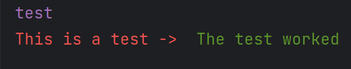

# Prettier_prints

Lightweight library for prettier terminal outputs similar to chalk for Java. Helping make Python
outputs easier to read and styled to your desires.

### Current functions:
 - out()

### Current available styling:
 - Bold
 - Underline
 - highlight
 - black
 - red
 - green
 - yellow
 - blue
 - magenta
 - cyan
 - white
 - bright_red
 - bright_green
 - bright_yellow
 - bright_blue
 - bright_magenta
 - bright_cyan
 - bright_white

Example:
```python
    from prettier_prints.prettier_prints import PrettierPrints
    pp = PrettierPrints()
    print(pp.out({'msg': "Let's turn this message red", 'style': 'red'}))
    print(pp.out({'msg': "Lets also underline it", 'style': 'red;underline'}))
    print(pp.out({'msg': "May as well bold it too", 'style': 'red;underline;bold'}))
    print(pp.out({'msg': "What about a blue background?", 'style': 'blue;highlight'}))
    print(f'This also works for output messages -> {pp.out(print_msg={"msg": "See :)", "style": "magenta;bold;underline"})}')
```

